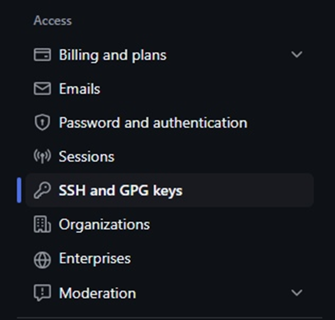

# Основы работы с Git и GitHub

## Содержание

1. [Цель работы](#цель-работы)
2. [Введение](#введение)
3. [Настройка ssh-соединения с GitHub](#настройка-ssh-соединения-с-github)
4. [Создание собственного репозитория](#создание-собственного-репозитория)
5. [Добавление файла с исходным кодом в репозиторий](#добавление-файла-с-исходным-кодом-в-репозиторий)
6. [Пуш файлов в удаленный репозиторий на GitHub](#пуш-файлов-в-удаленный-репозиторий-на-github)

---

## Цель работы

Освоить базовые навыки работы с гитом. Создать собственный репозиторий на GitHub, в котором будут выполняться лабораторные работы в рамках курса по основам программирования.

## Введение

В данной лабораторной работе будет рассказано как:

- Настроить ssh-соединение с GitHub;
- Создать свой собственный репозиторий для сдачи лабораторных работ и подключить его к основному репозиторию с информацией о лабораторных работах;
- Написать и проверить свою работу на соответствие минимальным требованиям для сдачи;
- Залить свою работу в свой репозиторий в GitHub.

## Настройка ssh-соединения с GitHub

> Данные указания по умолчанию относятся к операционным системам семейства Linux. Если у вас стоит WSL, то все действия следует выполнять в Linux, а не Windows консоли. Для MacOS рядом будут даны отдельные инструкции.

Сначала заведите свой аккаунт на [github.com](https://github.com).

В консоли Linux убедитесь, что у вас стоит **git**. Для этого введите следующую команду:

```bash
git --version
```

При необходимости поставьте **git** через команду:

```bash
sudo apt install git
```

ssh-соединение позволит работать с GitHub, аутентифицируясь через специальный приватный ключ, локально располагающийся на вашем устройстве. ssh-соединение категорически НЕ СЛЕДУЕТ настраивать на устройствах, предполагающих общий доступ (компьютеры в лабораторных аудиториях и т.п.).

Сгенерируйте ssh ключ следующей командой, где `your_email@example.com` следует заменить вашей почтой, на которую зарегистрирован аккаунт в GitHub.

```bash
ssh-keygen -t ed25519 -C "your_email@example.com"
```

Подтвердите расположение файла по умолчанию (нажав клавишу *enter*, дополнительно писать ничего не надо). Затем введите passphrase (**можно (и в данный момент рекомендуется) использовать пустую**, для этого просто снова нажмите *enter* без ввода). Подтвердите введенную passphrase.

Убедитесь, что в выводе присутствует ваш **fingerprint** и **key's randomart image**.

Запустите приложение **ssh-agent** в фоне. Для этого введите следующую команду:

```bash
eval "$(ssh-agent -s)"
```

Убедитесь, что в консоли вывелось следующее:

```
Agent pid ******
```

Где `******` — некоторое число.

Добавьте ваш приватный ключ в ssh-agent (**только для Linux**):

```bash
ssh-add ~/.ssh/id_ed25519
```

**Только для MacOS**:

```bash
ssh-add --apple-use-keychain ~/.ssh/id_ed25519
```

Выведите в консоль публичный ключ (**только для Linux**):

```bash
cat ~/.ssh/id_ed25519.pub
```

Скопируйте вывод из консоли.

Либо (**только для MacOS**) скопируйте в буфер обмена публичный ключ:

```bash
pbcopy < ~/.ssh/id_ed25519.pub
```

Затем пройдите на [github.com](https://github.com), в правом верхнем углу нажмите по иконке своего профиля, откройте настройки (**Settings**).


Слева в разделе **Access** выберите вкладку **SSH and GPG keys**.



Справа сверху нажмите на кнопку **New SSH key**. В поле **Title** введите название, которое будет описывать назначение данного ключа. В поле **Key** вставьте публичный ключ (который скопировали ранее). Подтвердите добавление нажав на кнопку **Add SSH key**.

Проверьте, что вы успешно настроили ssh-соединение. Для этого введите в консоли следующую команду:

```bash
ssh -T git@github.com
```

Подтвердите, что вы хотите установить соединение, написав `yes` (без кавычек) и нажав *enter*.

Убедитесь, что вывод соответствует следующему (где `username` — это ваш логин на github.com):

```
Hi username! You've successfully authenticated, but GitHub does not provide shell access.
```

## Создание собственного репозитория

Зайдите на [github.com](https://github.com) и создайте новый пустой **публичный** репозиторий.

Для этого нажмите на кнопку **New** в левой части главной страницы.

Назовите его так, как считаете нужным, но желательно достаточно информативно. Например, `Lastname-PIK-Labs-2026`, где вместо `Lastname` должна быть ваша фамилия на латинице.

Убедитесь, что вы создаете публичный, а не приватный репозиторий (должен стоять флажок напротив **Private**).

Оставьте все остальные настройки без изменений.

Создайте репозиторий, нажав на кнопку **Create repository**.

На странице вашего репозитория на github.com скопируйте ssh-ссылку на него (имеет формат вида `git@github.com:Username/Repo.git`). Открыв консоль Linux, перейдите в ту директорию, в которую вы хотите склонировать репозиторий. Склонируйте репозиторий с помощью команды:

```bash
git clone repo-url
```

Где `repo-url` — ssh-ссылка на ваш репозиторий. После этого в текущей директории должна появиться новая директория с вашим репозиторием. Перейдите в нее с помощью команды `cd`.

## Добавление файла с исходным кодом в репозиторий

Убедитесь, что вы находитесь в директории с вашим репозиторием. Для этого введите следующую команду:

```bash
git status
```

Должно вывестись:

```
On branch main

No commits yet
```

Откройте через консоль текущую директорию в VS Code:

```bash
code .
```

Где `.` — это указание на то, что нужно открыть текущую директорию.

Создайте новый `.py` файл, в котором будете писать код. Например, `file1.py`. Напишите код.

## Пуш файлов в удаленный репозиторий на GitHub

Находясь в папке своего репозитория, убедитесь, что git «видит» только новый файл с исходным кодом.

Для этого введите в консоли следующее:

```bash
git status
```

В untracked files должен быть показан только один файл: `file1.py` (или файл с другим названием, который вы создали в предыдущем пункте):

```
On branch main

No commits yet

Untracked files:
  (use "git add <file>..." to include in what will be committed)
        file1.py

nothing added to commit but untracked files present (use "git add" to track)
```

Теперь можно пушить все изменения:

```bash
git add .
```

Или пушить только определённые файлы:

```bash
git add file1.py
```

Закоммитьте изменения:

```bash
git commit -m "commit message"
```

Где вместо `commit message` введите на английском языке осмысленное сообщение к коммиту. Например, `add file1.py`.

Запушьте созданный коммит в удаленный репозиторий:

```bash
git push
```

> В дальнейшем перед сдачей каждой лабораторной работы надо будет закоммитить изменения и запушить их в свой удаленный репозиторий.

Откройте на [github.com](https://github.com) свой удаленный репозиторий. Убедитесь, что все изменения загружены. Далее на этот же репозиторий можно подгружать аналогичным образом отчёты о проделанных ЛР.

Если все указания выполнены, то покажите преподавателю ваш локальный и удаленный репозитории, чтобы получить доступ к выполнению основных лабораторных работ.
